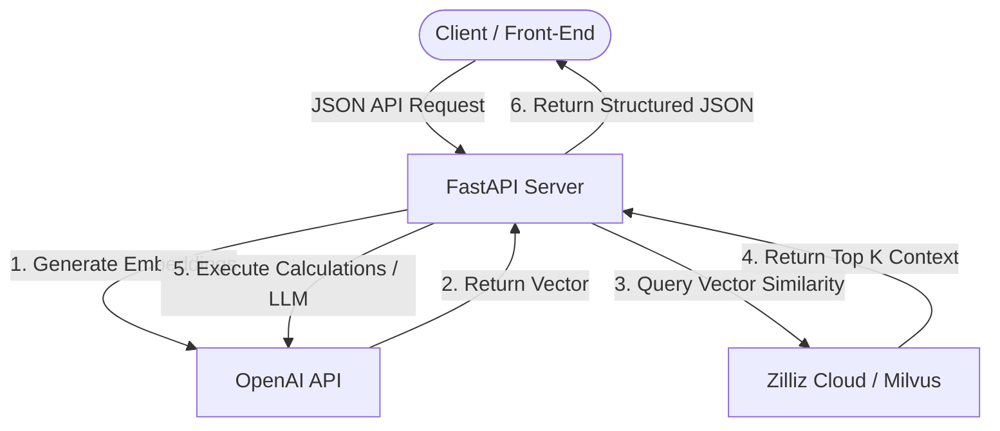

# Fraud Detection & Bank Compensation RAG API

A FastAPI-based application serving two core RegTech engines:
1. **Fraud Assessment Engine**: Analyzes digital payment fraud stories against known scenarios using retrieval-augmented generation (RAG).
2. **Mantra Compensation Eligibility Engine**: Identifies bank compensation rules based on RBI policies and automatically calculates the appropriate compensation/refund amount for digital payment delays, failures, and unauthorized transactions.

This API integrates with **Zilliz Cloud (Milvus)** for high-performance vector search and **OpenAI APIs** for embeddings and LLM reasoning.

---

## 🏗 System Architecture



---

## 📋 Prerequisites & Requirements

- **Python**: `3.9` or higher
- **Vector Database**: A Zilliz Cloud (or Milvus) instance with two collections configured.
- **External APIs**: OpenAI API key access.

---

## ⚙️ Environment Variables (`.env`)

Create a `.env` file in the root directory. Below is the list of variables that the hosting team must configure for cloud deployments:

```env
# --- OpenAI Configuration ---
OPENAI_API_KEY=your-openai-api-key
EMBEDDING_MODEL=text-embedding-3-small
LLM_MODEL=gpt-4o-mini

# --- Zilliz / Milvus Cloud Configuration ---
ZILLIZ_ENDPOINT=https://in03-xxxxxxxxxxxxxxx.serverless.gcp-us-west1.cloud.zilliz.com
ZILLIZ_API_KEY=your-zilliz-api-token
MILVUS_COLLECTION=fraud_scenarios
COMP_COLLECTION=bank_compensation_rules

# --- Application Tuning ---
TOP_K=5
INDEX_BATCH=64

# --- Financial Default Rules (RBI Policy defaults) ---
RBI_REPO_RATE=0.065
SB_INTEREST_RATE=0.03
```

---

## 🚀 Setup & Local Execution

### 1. Clone & Set Up Virtual Environment
```bash
# Navigate to the workspace
cd MT

# Create virtual environment
python3 -m venv venv
source venv/bin/activate

# Install dependencies
pip install -r requirements.txt
```

### 2. Collection Creation & Data Indexing
Before running the APIs, the Zilliz Vector DB collections must be created and populated with context datasets:

- **Create Collection**:
  ```bash
  python create_collection.py
  ```
- **Index Bank Compensation Rules** (Populates `bank_compensation_rules` using `Bank_Compensation_Policy_Guide.xlsx`):
  ```bash
  python indexer.py
  ```
- **Index Fraud Scenarios** (Populates `fraud_scenarios` using `fraud_scenarios.xlsx`):
  ```bash
  python indexer_old.py
  ```

### 3. Run the Development Server
```bash
uvicorn main:app --host 0.0.0.0 --port 8000 --reload
```
Once started, the interactive API documentation will be available at:
- **Swagger UI**: `http://localhost:8000/docs`
- **ReDoc**: `http://localhost:8000/redoc`

---

## ☁️ Cloud & Production Deployment Guide

For hosting on cloud platforms (AWS ECS/Fargate, Google Cloud Run, Azure Container Apps, or Render), use the following configurations.

### 1. Production ASGI Execution
In production, do not run with `--reload`. Use Gunicorn with Uvicorn workers for high concurrency and resilience:

```bash
gunicorn main:app -w 4 -k uvicorn.workers.UvicornWorker --bind 0.0.0.0:8000
```

### 2. Docker Containerization
Use the following `Dockerfile` to package the application.

```dockerfile
# Use an official Python runtime as a parent image
FROM python:3.10-slim

# Set system environment variables
ENV PYTHONUNBUFFERED=1 \
    PYTHONDONTWRITEBYTECODE=1

# Set the working directory in the container
WORKDIR /app

# Install system dependencies (needed for certain python libs)
RUN apt-get update && apt-get install -y --no-install-recommends \
    build-essential \
    && rm -rf /var/lib/apt/lists/*

# Copy requirements and install
COPY requirements.txt .
RUN pip install --no-cache-dir -r requirements.txt

# Copy application code and source spreadsheets
COPY app/ ./app/
COPY main.py .
COPY Bank_Compensation_Policy_Guide.xlsx .
COPY fraud_scenarios.xlsx .
COPY bank_policy.csv .

# Expose port 8000
EXPOSE 8000

# Start production server
CMD ["gunicorn", "main:app", "-w", "4", "-k", "uvicorn.workers.UvicornWorker", "--bind", "0.0.0.0:8000"]
```

### 3. Health Checks
- **HTTP Path**: `/docs` or `/openapi.json`
- **Interval**: 30 seconds
- **Timeout**: 5 seconds
- **Healthy Threshold**: 2 successes

---

## 🔌 API Documentation

### 1. Assess Fraud Scenario
This endpoint takes a description of a user's transaction story, embeds it, matches it with the most similar fraud scenarios from the vector database, and uses the LLM to generate an Indian digital payment fraud analysis report.

* **Endpoint**: `POST /fraud-assess`
* **Request Content-Type**: `application/json`

#### Request Payload
```json
{
  "user_story": "I received an SMS claiming my electricity bill was unpaid and my connection would be disconnected. I called the number, they made me download the AnyDesk app, and ₹50,000 was debited from my bank account.",
  "top_k": 5
}
```

#### Response Payload (Sample)
```json
{
  "probability": 0.0,
  "top_matches": [
    {
      "id": "12",
      "similarity": 0.8942,
      "metadata": {
        "title": "Electricity Bill Fraud via Remote Access App",
        "type": "Remote Access Scam",
        "summary": "Fraudster sends urgent message to download remote desktop apps like AnyDesk, TeamViewer to gain control."
      }
    }
  ],
  "markdown": "### 🔥 Fraud Probability (0–100%)\n95%\n\n### 🏷 Most Likely Fraud Type\nRemote Access Scam\n\n..."
}
```

---

### 2. Check Banking Compensation Eligibility
This endpoint analyzes a complaint against RBI's bank compensation policies. It performs structured LLM parameter extraction, queries the rule database, runs a deterministic formula to compute exact refund & interest, and yields a user-friendly explanation or lists missing details to ask the user.

* **Endpoint**: `POST /mantra_compensation`
* **Request Content-Type**: `application/json`

#### Request Payload
```json
{
  "user_message": "My UPI payment of Rs. 10000 was debited on 2026-05-10 but the merchant didn't receive it. It was only refunded back on 2026-05-20 by HDFC bank."
}
```

#### Response Payload (Sample)
```json
{
  "transaction_amount": "10000",
  "transaction_date": "2026-05-10",
  "compensation_eligible": true,
  "compensation_amount": "400",
  "other_info": "Since the failed UPI transaction took 10 days to resolve, which exceeded the standard 1-day turnaround time by 9 days, you are entitled to a delay compensation of Rs. 100 per day. HDFC Bank should credit Rs. 400 to your account.",
  "bank_name": "hdfc bank",
  "links": {
    "compensation_policy": "https://www.hdfcbank.com/personal/useful-links/regulatory-policies/compensation-policy",
    "grievance_policy": "https://www.hdfcbank.com/personal/useful-links/customer-redressal-system"
  }
}
```
